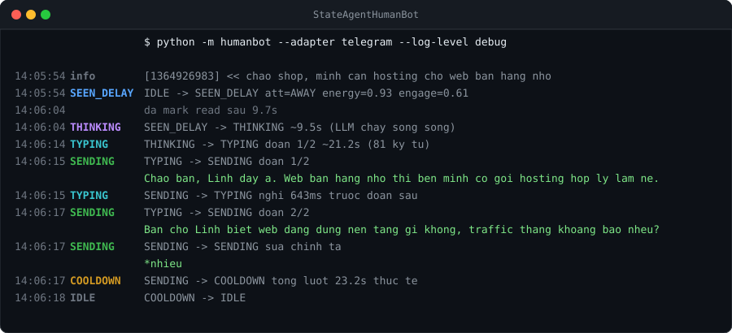

# StateAgentHumanBot

[](https://github.com/nguyenquocanhz/state-agent-human-bot/actions/workflows/tests.yml)
[](https://www.python.org/)
[](https://docs.telethon.dev/)
[](https://github.com/RFS-ADRENO/zca-js)
[](https://claude.com/)
[](LICENSE)

Chatbot nhắn tin theo **nhịp của người thật**: thấy tin rồi mới seen, seen rồi mới nghĩ,
nghĩ xong mới gõ, gõ lâu hay mau tùy độ dài câu trả lời — và đang gõ dở mà bị nhắn thêm
thì bỏ đó, đọc lại từ đầu. Chạy trên **Telegram** và **Zalo**.

Nội dung câu trả lời do Claude sinh ra, qua **claude-cli** hoặc gọi thẳng **Messages API**.

> **English**: A Telegram/Zalo userbot that replies with human timing — randomized read
> receipts, think time, typing duration proportional to message length, message splitting,
> typos with corrections, energy/circadian rhythm and sleep hours. Powered by Claude (via
> the `claude` CLI or the Messages API). Docs are in Vietnamese; code is self-explanatory.



*Log thật của một lượt trả lời trên Telegram — kể cả đoạn gõ sai rồi nhắn `*nhiêu` để sửa.*

## Bắt đầu trong 3 bước

```bash
pip install -r requirements.txt
python tools/setup.py
python -m humanbot --time-scale 0.2
```

`tools/setup.py` hỏi vài câu rồi tự sinh `.env`. Bước 3 chat thử ngay trong terminal — không
cần Telegram, không cần API key (chọn backend `mock`). `--time-scale 0.2` rút mọi độ trễ
xuống 1/5 cho đỡ ngồi đợi.

Chạy thật trên Telegram thì thêm 2 bước, xem [mục dưới](#chạy-thật-trên-telegram).

## Máy trạng thái

```
                 ┌──────────────── tin nhắn mới đến bất cứ lúc nào ───────────────┐
                 │                          (ngắt & đọc lại)                      │
                 ▼                                                                │
   [IDLE] ──► [SEEN_DELAY] ──► [THINKING] ──► [TYPING] ──► [SENDING] ──► [COOLDOWN]
              mark read        LLM chạy       phát action   tách đoạn     nghỉ một
              sau n giây       song song      "đang soạn"   nếu quá dài   nhịp → IDLE
```

Mỗi cuộc hội thoại một máy trạng thái riêng, chạy độc lập trên asyncio. Đồ thị chuyển trạng
thái được **ép kiểm tra** — chuyển sai là ném lỗi ngay.

## Tạo persona cho việc của bạn

Đây là phần bạn sẽ sửa nhiều nhất. Mỗi persona là **một file JSON**, không cần đụng code:

```bash
cp config/persona.default.json config/persona.cua-toi.json
python -m humanbot --persona config/persona.cua-toi.json
```

Ba bản mẫu có sẵn để tham khảo cách chỉnh:

| File | Nhân vật | Đặc điểm |
|---|---|---|
| `persona.default.json` | An | trợ lý trung tính, ngắn gọn |
| `persona.sales.json` | Linh | tư vấn bán hàng, thân mật, hay hỏi lại |
| `persona.friend.json` | Mint | bạn thân, gõ nhanh 58 wpm, sai chính tả nhiều, thức tới 2h sáng |
| `persona.mainboard.json` | Tú | thợ sửa main 15 năm — soi ảnh board, vẽ sơ đồ đường nguồn |

Phần nội dung — quyết định bot **nói gì**:

```jsonc
"name": "An",
"bio":  "Tro ly ca nhan, tra loi ngan gon va thang vao van de.",
"expertise": [ "kiến thức + quy trình nghề — phần làm nên chất lượng câu trả lời" ],
"style":     [ "giọng điệu, cách xưng hô, cách nhắn" ],
"rules":     [ "luật định dạng, thay thế bộ mặc định nếu persona cần khác" ]
```

`expertise` và `rules` là tùy chọn. Persona tám phào thì bỏ trống cả hai — nhưng persona làm
việc thật thì `expertise` chính là chỗ đáng đầu tư nhất, còn `rules` để gỡ các luật mặc định
không hợp (ví dụ luật "không bullet" sai với thợ cần liệt kê từng bước đo).

Xem prompt cuối cùng mà một persona sinh ra:

```bash
python tools/show_prompt.py config/persona.mainboard.json
```

Phần nhịp — quyết định bot **nhắn như thế nào**:

| Khóa | Ý nghĩa | Tăng lên thì |
|---|---|---|
| `typing.wpm` | tốc độ gõ (từ/phút) | gõ nhanh hơn, typing indicator ngắn lại |
| `typing.hesitationRate` | xác suất khựng giữa lúc gõ | hay tắt/bật lại "đang soạn tin" |
| `seen.activeMedianMs` | bao lâu thì seen khi đang cầm máy | seen chậm hơn |
| `seen.awayMedianMs` | bao lâu thì seen khi đang bận | tin đầu treo lâu hơn |
| `think.readCps` | tốc độ đọc (ký tự/giây) | nghĩ nhanh hơn |
| `think.burstGraceMs` | chờ đối phương gõ nốt | kiên nhẫn hơn, ít cắt lời |
| `send.splitThreshold` | quá bao nhiêu ký tự thì tách tin | tin dài hơn, ít tin lẻ |
| `send.maxChunks` | tối đa mấy tin một lượt | nhắn dồn nhiều hơn |
| `typo.rate` | xác suất gõ sai một từ | sai nhiều hơn, tự sửa `*từ_đúng` |
| `sleep.startHour/endHour` | khung giờ ngủ | ngủ nhiều hơn, tin đêm để sáng trả lời |
| `sleep.timezoneOffsetMin` | múi giờ (420 = GMT+7) | — |
| `rhythm.*` | tốc độ mất/hồi sức và độ hào hứng | xem mục dưới |

## Gửi ảnh cho bot soi

Bot đọc được ảnh đính kèm — gửi ảnh chụp board qua Telegram, nó tải về `data/media/` rồi đưa
cho model xem cùng câu hỏi. Hoạt động trên **cả hai backend**:

| Backend | Cách đưa ảnh vào |
|---|---|
| `--llm claude` | lưu file rồi đưa đường dẫn, claude-cli mở bằng Read tool (chế độ `--restricted` vẫn giữ Read — đã kiểm chứng) |
| `--llm api` | nhúng base64 vào content block của Messages API |

Thử ngay trong terminal không cần Telegram:

```bash
python -m humanbot --persona config/persona.mainboard.json
/img anh-chup-board.jpg soi hộ em chỗ này cháy gì vậy
```

Ảnh **không** được lưu vào lịch sử hội thoại dưới dạng base64 — nếu lưu thì file phình to và
mỗi lượt sau đều phải gửi lại cả ảnh. Lịch sử chỉ ghi `[da gui 1 anh]` kèm phần chữ.

Sticker, voice, video đều bị bỏ qua. Giới hạn 8MB mỗi ảnh (`max_image_bytes`). Riêng Zalo thì
cầu nối Node hiện chưa chuyển ảnh sang — mới chỉ có tin chữ.

## Vẽ sơ đồ bằng ký tự

Persona có thể vẽ chuỗi đường nguồn ngay trong tin nhắn, và chunker **giữ nguyên vẹn** khối đó:
không gộp khoảng trắng, không cắt giữa chừng, tách thành một tin riêng.

```
BATT+ 3.9V
   │
  [F1] cầu chì  ── đo 2 đầu: <1Ω
   │
   ├──[C12]── GND   (chạm thì <5Ω)
   │
  [L1]
   │
 PP_VDD_MAIN 3.8V → PMIC U2
```

`looks_like_diagram()` nhận diện khối vẽ qua ký tự khung (`─ │ ├ └ →`) hoặc ≥2 dòng có `|`.
Điều kiện đủ chặt để văn xuôi có dấu gạch ngang không bị nhầm là sơ đồ.

## Mô hình "tâm lý"

Ba biến trạng thái nội tại, cập nhật sau mỗi lượt, lưu trong `data/sessions.json`:

- **energy** (0..1) — độ tỉnh táo. Gõ nhiều thì tụt, nghỉ lâu thì hồi, trần bị giới hạn bởi
  nhịp sinh học theo giờ trong ngày. Energy thấp → gõ chậm, nghĩ lâu hơn.
- **engagement** (0..1) — độ hào hứng. Tăng khi đối phương nhắn liên tục/nhắn dài, giảm dần
  theo thời gian im lặng. Engagement cao → seen nhanh, phản xạ nhanh.
- **attention** — `ACTIVE` (vừa nhắn xong, <2 phút) / `IDLE` (<20 phút) / `AWAY` / `ASLEEP`.
  Quyết định khoảng cách từ lúc tin đến lúc seen: vài giây, vài chục giây, vài phút, hay
  **để sáng mai trả lời**.

Mọi độ trễ bốc từ phân phối **log-normal** chứ không phải `random.uniform`: phần lớn giá trị
quanh median, thỉnh thoảng có đuôi dài — đúng kiểu người bị phân tâm.

Vài chi tiết nhỏ nhưng làm nên khác biệt:

- **Gộp tin nhắn**: đang seen/nghĩ/gõ đoạn đầu mà nhận thêm tin → hủy lượt, gộp hết lại trả
  lời một thể.
- **Chờ gõ nốt**: tin kết thúc lửng (không dấu câu) → nán lại vài giây xem có tin tiếp không.
- **Gõ sai rồi sửa**: xác suất nhỏ gõ sai một từ, vài giây sau nhắn `*từ_đúng`.
- **Chưa kịp gửi**: bị ngắt khi mới gửi được nửa số đoạn thì phần còn lại bị bỏ — và lượt sau
  prompt có thẻ `<chua_gui>` để model biết đối phương **chưa hề đọc** đoạn đó.

## Chạy thật trên Telegram

Dùng **Telethon** (MTProto, đăng nhập bằng tài khoản thật) chứ không phải Bot API, vì chỉ tài
khoản thật mới:

| | Telethon | Bot API |
|---|---|---|
| Đánh dấu **đã xem** | `send_read_acknowledge` ✅ | ❌ không có |
| **Đang soạn tin** | `SetTypingRequest` ✅ | có, nhưng kèm nhãn bot |
| Giao diện phía người nhận | như người thật | luôn hiện "bot" |

```bash
python tools/tg_login.py                  # đăng nhập + in ra id để whitelist
python -m humanbot --adapter telegram
```

`tg_login.py` hỏi số điện thoại rồi mã OTP (mã về trong chính Telegram, không phải SMS), lưu
session vào `data/` — lần sau không hỏi lại. Xong nó liệt kê người và group kèm id.

Điền id được phép vào `.env`:

```
TG_ALLOWED=123456789,@ban_than
TG_ALLOW_GROUPS=true        # trong group chỉ trả lời khi bị @mention hoặc reply
```

> ⚠️ **Đây là userbot chạy trên tài khoản Telegram thật.** Telegram cấm spam và tự động hóa
> gây phiền người khác — tài khoản có thể bị hạn chế hoặc khóa. Chỉ dùng cho tài khoản của
> bạn và những người đã đồng ý.
>
> `TG_ALLOWED` để trống thì bot **không khởi động** — vì để trống nghĩa là trả lời mọi người
> nhắn tới, kể cả bạn bè và khách hàng thật. Muốn vậy thật thì phải khai
> `TG_ALLOW_EVERYONE=true`.

## Chạy trên Zalo

Zalo có hai đường hoàn toàn khác nhau, và chúng **không tương đương**:

| | `--adapter zalo` (tài khoản cá nhân) | `--adapter zalo-oa` (Official Account) |
|---|---|---|
| Ai dùng được | ai cũng được | phải có doanh nghiệp đăng ký OA |
| Đánh dấu **đã xem** | ✅ `sendSeenEvent` | ❌ không có API |
| **Đang soạn tin** | ✅ `sendTypingEvent` | ❌ không có API |
| Chính thức | ❌ giả lập Zalo Web | ✅ OpenAPI chính thức |
| Rủi ro khoá nick | **cao** | không |

Nói thẳng: trên **OA** thì hai trong ba tín hiệu của dự án này biến mất, chỉ còn độ trễ và
tách tin. Muốn giống người thật đầy đủ thì phải dùng tài khoản cá nhân, đổi lại là rủi ro.

### Tài khoản cá nhân

Zalo không có API chính thức cho tài khoản cá nhân, và thư viện Python duy nhất (`zlapi`)
**đã bị archive từ 11/2024**. Thư viện còn sống là [`zca-js`](https://github.com/RFS-ADRENO/zca-js)
(TypeScript). Nên phần nói chuyện với Zalo chạy bằng Node, còn máy trạng thái vẫn là Python —
hai bên nói qua stdio, mỗi dòng một JSON (`zalo_bridge/bridge.mjs`).

```bash
cd zalo_bridge && npm install && cd ..
python -m humanbot --adapter zalo
```

Lần đầu nó lưu mã QR vào `data/zalo-qr.png` — mở ảnh đó, quét bằng Zalo trên điện thoại. Xong
phiên đăng nhập được lưu vào `data/zalo-credentials.json`, lần sau không cần quét lại.

Điền người được phép vào `.env` (`ZALO_ALLOWED=`, không điền thì bot không chạy). Chưa biết id
thì cứ chạy thử với `--log-level debug`, log sẽ in id của người nhắn tới.

> ⚠️ `zca-js` giả lập trình duyệt, trái điều khoản Zalo và **có thể làm khoá tài khoản**. Rủi
> ro cao hơn Telegram đáng kể — Telegram công khai API và cho phép client thứ ba, Zalo thì
> không. Dùng nick phụ, đừng dùng nick chính.
>
> Cũng lưu ý: Zalo Web chỉ cho **một listener chạy mỗi lúc** — mở Zalo trên trình duyệt là
> bot bị ngắt kết nối.

### Official Account

```bash
ZALO_OA_ACCESS_TOKEN=... python -m humanbot --adapter zalo-oa
```

Chạy webhook server ở `PORT` (mặc định 8080), cần URL public để Zalo gọi vào (ngrok,
Cloudflare Tunnel...). Endpoint gửi tin lấy theo tài liệu cộng đồng — nếu Zalo đổi thì sửa
`ZALO_API_BASE` / `ZALO_TOKEN_HEADER` trong `.env`, không phải sửa code.

## Các cờ hay dùng

| Cờ | Ý nghĩa |
|---|---|
| `--adapter console\|telegram\|zalo\|zalo-oa` | kênh chat (mặc định `console`) |
| `--llm claude\|api\|mock` | backend sinh câu trả lời |
| `--persona <file.json>` | đổi tính cách |
| `--time-scale 0.2` | rút gọn mọi độ trễ để demo/debug |
| `--dry-run` | chỉ in ra màn hình, không seen/typing/gửi thật |
| `--seed 42` | cố định ngẫu nhiên để tái lập được |
| `--log-level debug` | in cả độ trễ đã bốc thăm và id chat bị bỏ qua |

Đóng stdin (Ctrl+D) thì bot trả nốt lượt đang dở rồi mới thoát; Ctrl+C là dừng ngay.

## Hai backend LLM

| | `--llm claude` (claude-cli) | `--llm api` (Messages API) |
|---|---|---|
| Xác thực | dùng đăng nhập sẵn của `claude` | cần `ANTHROPIC_API_KEY` |
| Lịch sử hội thoại | claude-cli tự nhớ qua `--resume` | bot tự giữ, `data/history/<id>.json` |
| Overhead mỗi lượt | ~25.700 token (system + tool của Claude Code) | ~249 token (chỉ system prompt) |
| Phụ thuộc | binary `claude` (~236MB RAM mỗi lần gọi) | chỉ gói `anthropic` |

```bash
python tools/cost_compare.py --turns 10 --per-day 500
```

Hội thoại 10 lượt, sonnet — số của claude-cli là **đo thật**, số của API là ước tính (thêm
`--exact` và một API key thì script đếm token thật qua `count_tokens`):

| backend | lượt đầu | lượt sau | TB/lượt | 500 lượt/ngày |
|---|---|---|---|---|
| claude-cli sonnet | $0.0326 | $0.0122 | $0.0142 | $7.12 |
| API claude-sonnet-5 | $0.0021 | $0.0042 | $0.0032 | $1.58 |
| API claude-haiku-4-5 | $0.0011 | $0.0021 | $0.0016 | $0.79 |

Khoảng cách hẹp lại khi hội thoại dài ra (API phải gửi lại lịch sử, còn claude-cli đọc lịch
sử từ cache với giá 0.1x): 60 lượt thì chỉ còn rẻ hơn 2 lần. Chặn trần bằng
`ANTHROPIC_MAX_HISTORY` (mặc định 40 tin).

## Cấu trúc

```
humanbot/
  __main__.py          điểm chạy: python -m humanbot
  config.py            .env + tham số dòng lệnh + nạp persona
  engine.py            điều phối: mỗi cuộc hội thoại một state machine
  machine.py           ★ state machine: IDLE → SEEN → THINK → TYPE → SEND → COOLDOWN
  humanizer.py         ★ toàn bộ công thức độ trễ (hàm thuần, dễ test)
  chunker.py           tách câu trả lời dài thành nhiều tin, không cắt vào code block
  typo.py              gõ sai + tin nhắn sửa lại
  prompt.py            system prompt từ persona + đóng gói ngữ cảnh thời gian
  store.py             lưu session-id + energy/engagement theo từng người
  states.py            enum trạng thái + đồ thị chuyển hợp lệ (sai là ném lỗi)
  clock.py             đồng hồ tăng tốc được (time_scale)
  llm/claude_cli.py    gọi claude -p --output-format json, tự --resume theo hội thoại
  llm/anthropic_api.py gọi thẳng Messages API, tự giữ lịch sử + tính tiền từng lượt
  adapters/telethon_adapter.py   Telegram qua Telethon (tài khoản thật)
  adapters/zalo_adapter.py       Zalo cá nhân, qua cầu nối Node
  adapters/zalo_oa_adapter.py    Zalo Official Account (webhook + OpenAPI)
  adapters/console.py            chat thử trong terminal
  adapters/base.py               giao diện 4 hàm cho adapter mới
zalo_bridge/bridge.mjs   cầu nối Node <-> Python cho Zalo cá nhân (zca-js)
tools/setup.py         trợ lý tạo .env
tools/show_prompt.py   in ra system prompt của một persona
tools/tg_login.py      đăng nhập Telegram + lấy id để whitelist
tools/cost_compare.py  so chi phí hai backend
```

Thêm kênh chat mới (Messenger, Zalo, Discord...) = viết thêm một adapter với 4 hàm:
`mark_seen`, `set_typing`, `send`, và gọi `on_message` khi có tin tới. Xem `adapters/base.py`.

## Test

```bash
python -m unittest discover -s tests -v
```

63 test, chạy ~4 giây, dùng `MockLlm` + đồng hồ tăng tốc nên không gọi API và không tốn tiền.
Phủ: biên độ trễ, tách đoạn không cắt code block, vòng đời state machine (kể cả ngắt giữa
chừng), backend API, bộ lọc "ai được bot trả lời", và giao thức hai adapter Zalo.

## Yêu cầu

- Python 3.10+ (đã chạy trên 3.14)
- `pip install -r requirements.txt` — Telethon; `anthropic` chỉ cần nếu dùng `--llm api`
- Claude Code CLI nếu dùng `--llm claude` (`claude --version` để kiểm tra)
- Node 18+ nếu dùng `--adapter zalo` (cầu nối chạy `zca-js`)

## Trạng thái kiểm chứng

Không phải phần nào cũng được chạy thật như nhau — nói rõ để bạn khỏi mất thời gian:

| Phần | Trạng thái |
|---|---|
| Máy trạng thái, humanizer, chunker, typo | đã chạy thật + 58 test |
| Telegram (Telethon) | **đã chạy thật** trên tài khoản thật, seen/typing/tách tin đều đúng |
| Backend claude-cli | **đã chạy thật**, số chi phí trong README là đo được |
| Backend Messages API | logic có test với client giả, **chưa gọi mạng thật** |
| Zalo cá nhân (zca-js) | zca-js 2.2.0 đã cài + xác nhận có đủ hàm cần; **chưa đăng nhập thật** |
| Zalo OA | hình dạng request lấy từ tài liệu cộng đồng, **chưa chạy với token thật** |

MIT License.
